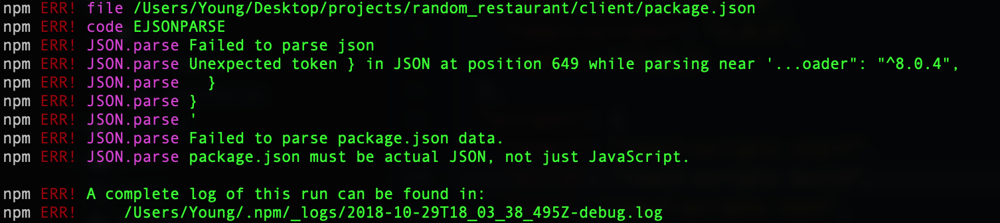
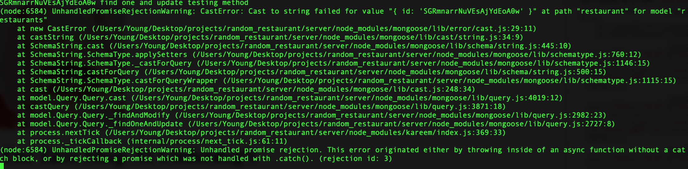

# random_restaurant
randomly selects restaurant using yelp api

## Things to do
* ~~Connect Yelp API~~
* Create db to post comments
  * Restaurant Schema
  * User Schema
* route to landing page based on restaurant ID
  * figure out what data to pass to landing package
  * post comments on page -- connect db to landing
* keep track of likes
* Need Auth
* ~~Incorporate Redux~~
* ~~Create Routes~~
* Create error handler

---------------------------------------------------
## STACK
* YELP API
* React - front end
* Redux - state management
* Node - back end

--------------------------------------------------
#### Errors I encountered
1. ~~babel loader in react-scripts were missing~~
2. ~~CORS issues~~
    * used cors middleware, or could add headers in request
3. [Resolved] 
    * dev dependencies in client package.json was messed up.
4. ~~axios promise function was returning undefined when moved to a helper function in /client/controlelr/yelp_api.js~~
    * needed to return axios method in same line.
5. ~~Mongoose's findOneAndUpdate() is executing Mongo's FindAndModify()~~
    * set ('useFindAndModify', false)
6. Mongoose/Mongo findOneAndUpdate {upsert: true} is replacing an exisiting object instead of creating a new one when field does not exist.
7. ~~Mongoose cast to string error:~~
    * 
        * had type: string in restaurant Models. --> (https://github.com/Automattic/mongoose/issues/4181)
